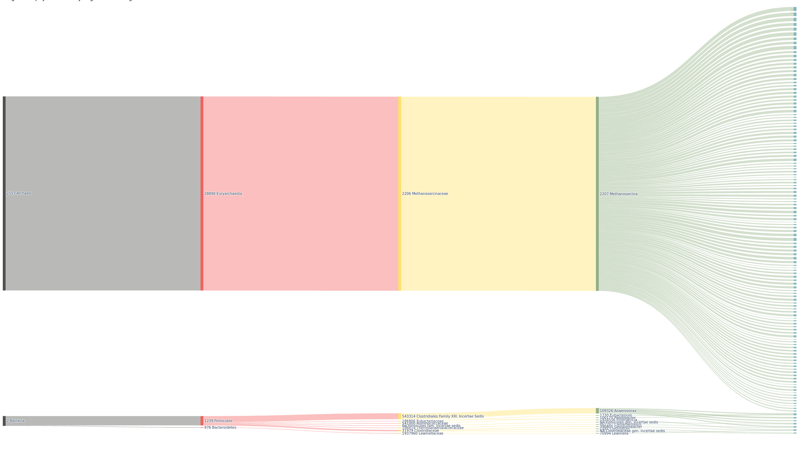
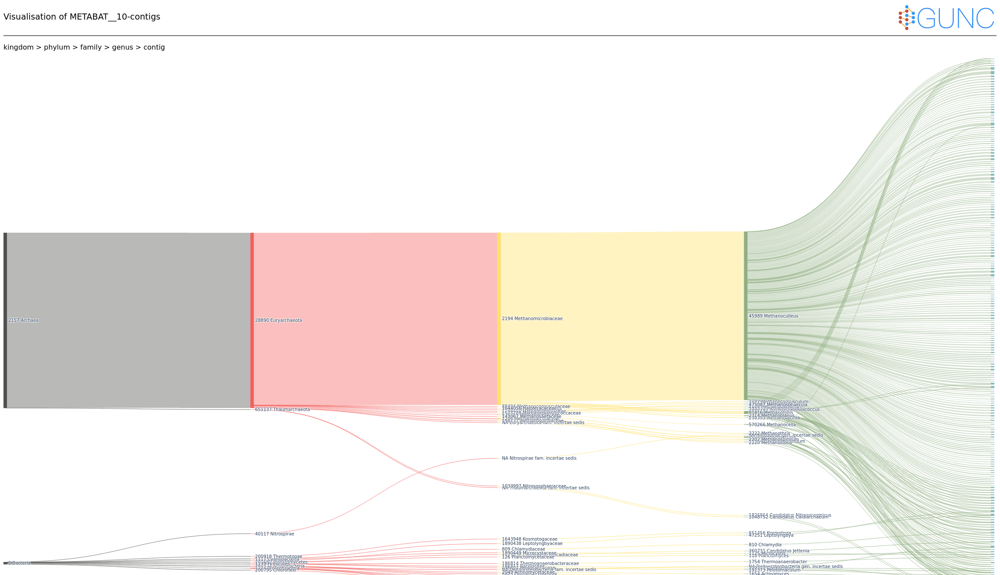
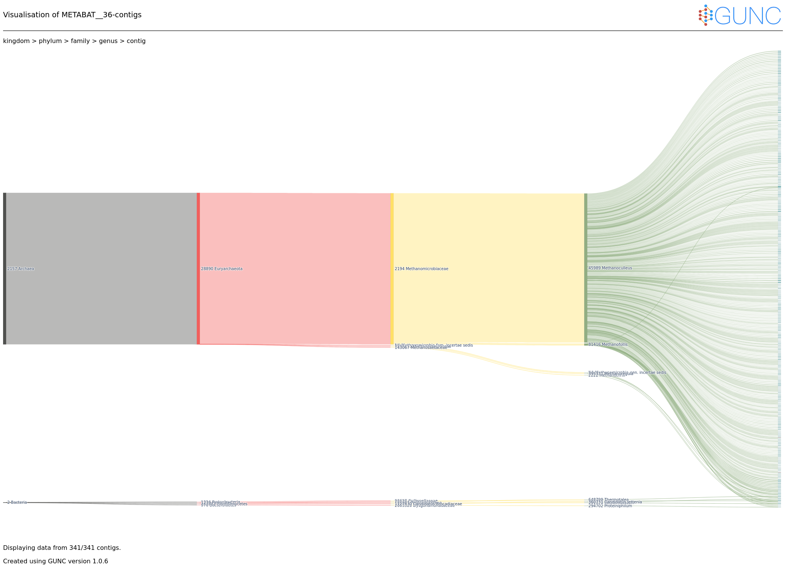

# Bin Refinement

In our analysis, we only focus on archea bins. so we Firstly need to refine our Archea bins from bacterial bins. To determine archeal bins we will summarise our metabat bins and then use the index files in metabat summary folder.

```bash
module load gcc12-env/12.1.0
module load micromamba
cd $WORK
micromamba activate .micromamba/envs/00_anvio/

cd /work_beegfs/sunam227/metagenomics/0_raw_reads/clean
anvi-summarize -p ./mergedprof/PROFILE.db -c contigs.db --list-collections

cd /work_beegfs/sunam227/metagenomics/0_raw_reads/clean
anvi-summarize -c contigs.db -p ./mergedprof/PROFILE.db -C METABAT2 -o ./SUMMARY_METABAT2 --just-do-it
```

We have determined our archeal bins as:
- METABAT__8
- METABAT__10
- METABAT__36

using these bins we will perform a Chimera detection in MAGs. But first we need to refine these bins from non-archeal ones.

```bash
cd /work_beegfs/sunam227/metagenomics/0_raw_reads/clean/SUMMARY_METABAT2/bin_by_bin

mkdir ../../ARCHAEA_BIN_REFINEMENT

cp ./METABAT__10/*.fa ../../ARCHAEA_BIN_REFINEMENT
cp ./METABAT__36/*.fa ../../ARCHAEA_BIN_REFINEMENT
cp ./METABAT__8/*.fa ../../ARCHAEA_BIN_REFINEMENT
```

# Chimera detection

Chimeric genomes are genomes assambled out of two or more genomes of different organisms by mistake. using GUNC we will detect if there is chimerism in our archeal genomes.

```bash
module load gcc12-env/12.1.0
module load micromamba/1.3.1
micromamba activate 00_gunc

cd /work_beegfs/sunam227/metagenomics/0_raw_reads/clean/SUMMARY_METABAT2/bin_by_bin/ARCHAEA_BIN_REFINEMENT

for i in *.fa; do mkdir /work_beegfs/sunam227/metagenomics/0_raw_reads/06_gunc/"$i"_out; done

for i in *.fa; do
  gunc run -i "$i" -r $WORK/databases/gunc/gunc_db_progenomes2.1.dmnd --out_dir /work_beegfs/sunam227/metagenomics/0_raw_reads/06_gunc/"$i"_out --threads 12 --detailed_output
done


cd /work_beegfs/sunam227/metagenomics/0_raw_reads/06_gunc/METABAT__8-contigs.fa_out
gunc plot -d ./diamond_output/METABAT__8-contigs.diamond.progenomes_2.1.out -g ./gene_calls/gene_counts.json

cd /work_beegfs/sunam227/metagenomics/0_raw_reads/06_gunc/METABAT__10-contigs.fa_out
gunc plot -d ./diamond_output/METABAT__10-contigs.diamond.progenomes_2.1.out -g ./gene_calls/gene_counts.json

cd /work_beegfs/sunam227/metagenomics/0_raw_reads/06_gunc/METABAT__36-contigs.fa_out
gunc plot -d ./diamond_output/METABAT__36-contigs.diamond.progenomes_2.1.out -g ./gene_calls/gene_counts.json
```

and here we can see our results for each bin:

### METABAT__8

### METABAT__10

### METABAT_36



