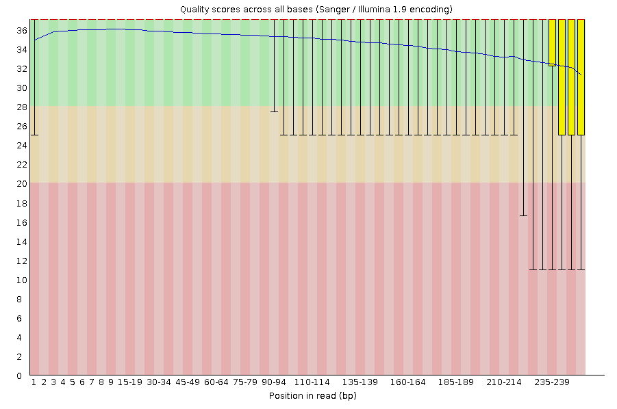
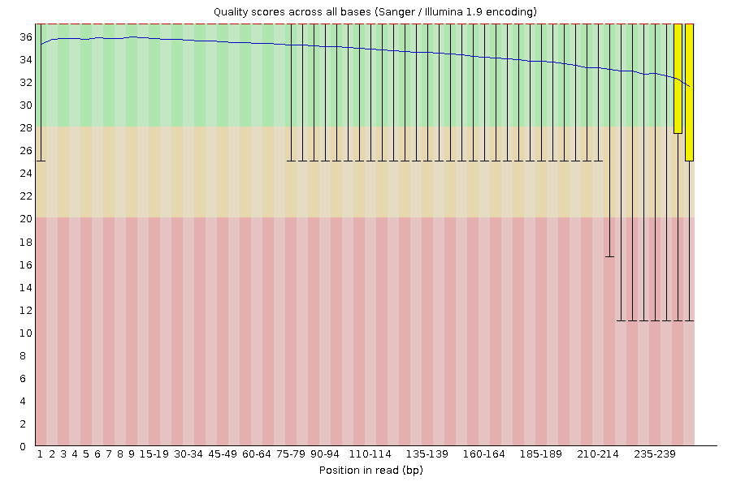
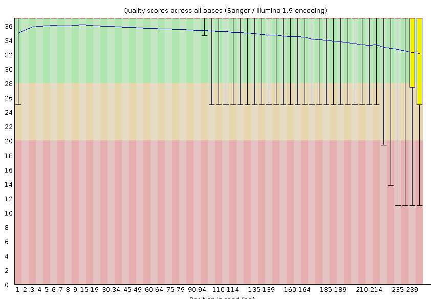
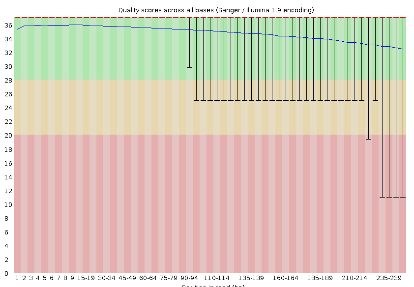

# GENOMIS
Genome is complete set of genetic information in an organism. (Add what is Genomics)

Key Terms:
- DNA
- Genes
- Non-coding DNA
- Chromosomes
- Genetic Information
- Variation
- Sequencing and Analysis

Pan-Genomics is the field of genomis that studies the full complement od genes and non coding sequences in a group of related organisms.

Transcriptomics is the study of the transcriptome, the complete set of RNA transcripts by the genome under specific circumstances or in a specific cell.
- Expressed Genes
- Gene Function
- Gene Regulation
- Molecular Mechanisms

Translatomics is the study of the complete sets of RNA molecules being translated into protein in a cell at any given time. This area examines translation process rather than transcriptomics.

### Steps of Assembeling a Genome:
1. DNA sample preperation
2. Sequencing
3. Quality Control
4. Read Alingment/Mapping
5. De Novo Assembly
6. Scaffolding
7. Gap Filling
8. Error Correction
9. Validation and Refinement
10. Annotation
11. Taxonomic Classification
12. Analysis

! we need to write if we can have paired and of long reads !

```bash
#!/bin/bash
#SBATCH --job-name=TASK
#SBATCH --output=TASK.out
#SBATCH --error=TASK.err
#SBATCH --nodes=1
#SBATCH --ntasks-per-node=1
#SBATCH --cpus-per-task=1
#SBATCH --mem=8GB
#SBATCH --partition=base
#SBATCH --time=00:20:00
#SBATCH --reservation=biol217

#load necessary modules
module load gcc12-env/12.1.0
module load micromamba
eval "$(micromamba shell hook --shell=bash)"
export MAMBA_ROOT_PREFIX=$WORK/.micromamba

cd $WORK
```

## Quality Control

Here we used <code style="color : lightskyblue">fastqc</code> to evaluate the quality of the raw paired-end short reads. This step is crucial to identify potential issues with our sequences. Such issues might be low base calling, contamination by adapter sequences and over-represented k-mers, GC content biases, etc. By using <code style="color : lightskyblue">fastqc</code>, we will know what we need to trim, and remove from our reads.

```bash
# Quality Control of R1 and R2 Raw Reads
cd /work_beegfs/sunam227/genomics
mkdir -p ./short_reads_processed/short_reads_qc
for file in ./0_raw_reads/short_reads/*.gz; do
    fastqc $file -o ./short_reads_processed/short_reads_qc -t 32;
done
```
Here you can see the quality check results of the short reads.

### Quality of Raw Read R1

### Quality of Raw Read R2


Then I used <code style="color : lightskyblue">fastp</code> to clean short reads. <code style="color : lightskyblue">fastp</code> filters out low quality reads based on phred score, removes poor-quality bases from ends of reads, and remove adapter sequences which were detected during initial <code style="color : lightskyblue">fastqc</code> report. In our sequences, we did not find any kind of adapter contamination.

```bash
# Quality Trimming and Cleaning of R1 and R2 Raw Reads
cd /work_beegfs/sunam227/genomics
mkdir -p ./short_reads_processed/clean_reads
fastp -i ./0_raw_reads/short_reads/241155E_R1.fastq.gz \
 -I ./0_raw_reads/short_reads/241155E_R2.fastq.gz \
 -R ./short_reads_processed/clean_reads/fastp_report \
 -h ./short_reads_processed/clean_reads/report.html \
 -o ./short_reads_processed/clean_reads/241155E_R1_clean.fastq.gz \
 -O ./short_reads_processed/clean_reads/241155E_R2_clean.fastq.gz -t 6 -q 25

# Quality Control of R1 and R2 Cleaned Reads
cd /work_beegfs/sunam227/genomics
for file in ./short_reads_processed/clean_reads/*.gz; do
    fastqc $file -o ./short_reads_processed/short_reads_qc -t 32;
done
```
Here you can see the <code style="color : lightskyblue">fastqc</code> result after our cleaning and trimming process

### Quality of Cleaned Read R1

### Quality of Cleaned Read R2


Read1 before filtering:
total reads: 1639549
total bases: 411526799
Q20 bases: 388578215(94.4236%)
Q30 bases: 354526745(86.1491%)

Read1 after filtering:
total reads: 1613392
total bases: 395124999
Q20 bases: 374956131(94.8956%)
Q30 bases: 343313213(86.8872%)


Read2 before filtering:
total reads: 1639549
total bases: 411526799
Q20 bases: 385928972(93.7798%)
Q30 bases: 353698765(85.9479%)

Read2 after filtering:
total reads: 1613392
total bases: 395124999
Q20 bases: 373763591(94.5938%)
Q30 bases: 343873143(87.029%)


Filtering result:
reads passed filter: 3226784
reads failed due to low quality: 52310
reads failed due to too many N: 4
reads failed due to too short: 0
reads with adapter trimmed: 4206
bases trimmed due to adapters: 319560

Duplication rate: 4.12309%

In addition to our short reads, we also had long reads. Long reads are required to fill gaps that might occur during short read assembly. Just like short reads, we also need to control the quality of our long reads and eliminate poor-quality reads. Here, I use <code style="color : lightskyblue">NanoPlot</code> to perform initial quality assesment of the single end long reads. 

```bash
micromamba activate 02_long_reads_qc

# Quality Control of Raw Long Reads NanoPlot
cd $WORK/genomics/0_raw_reads/long_reads/
mkdir -p $WORK/genomics/long_reads_processed/long_reads_qc/nanoplot_raw
NanoPlot --fastq $WORK/genomics/0_raw_reads/long_reads/*.gz \
 -o $WORK/genomics/long_reads_processed/long_reads_qc/nanoplot_raw -t 16 \
 --maxlength 40000 --minlength 1000 --plots kde --format png \
 --N50 --dpi 300 --store --raw --tsv_stats --info_in_report
```

Here we obtained the fallowing statistics:
1. Read Lenght Distribution
2. Quality Score Distribution
3. Overall Yield of Sequencing Data

### Read Quality vs. Read Lenght for Raw Long Reads


### Read Lenght Distribution for Raw Long Reads


Next I used <code style="color : lightskyblue">Filtlong</code> to clean and filter the long reads. <code style="color : lightskyblue">Filtlong</code> was used to retain high quality base calling data based on phred score, filter out reads that are too short, and ensure the most informative and relaible reads were kept for downstreem analysis.

This step is essential because long reads tend to contain higher error rates compared to short reads.

After this step, I did post-cleaning quality check with <code style="color : lightskyblue">NanoPlot</code> again to confirm the improvements on the reads' quality. 

```bash
# Trimming and Cleaning of Long Reads by Filtlong
cd $WORK/genomics
mkdir ./long_reads_processed/clean_reads
filtlong --min_length 1000 --keep_percent 90 ./0_raw_reads/long_reads/*.gz | gzip > ./long_reads_processed/clean_reads/241155E_cleaned_filtlong.fastq.gz

# Quality Control of Cleaned Long Reads by NanoPlot
cd $WORK/genomics/long_reads_processed
mkdir -p $WORK/genomics/long_reads_processed/long_reads_qc/nanoplot_cleaned
NanoPlot --fastq ./clean_reads/*.gz \
 -o ./long_reads_qc/nanoplot_cleaned -t 16 \
 --maxlength 40000 --minlength 1000 --plots kde --format png \
 --N50 --dpi 300 --store --raw --tsv_stats --info_in_report
```

### Read Quality vs. Read Lenght for Processed Long Reads


### Lenght Distribution for Processed Long Reads


## Genome Assembly

I used <code style="color : lightskyblue">Uniycler</code> to perform the genome assembly. <code style="color : lightskyblue">Uniycler</code> is a hybrid assembly tool that integrates both short reads and long reads to produce a high quality genome assembly. <code style="color : lightskyblue">Uniycler</code> combines the strenght of both data types. High base call accuracy of short reads to compensate errors in long reads, and contiguity of long reads to connect short reads. This hybrid approach increases the accuracy and completeness of the assembly.

```bash
# Hybrid Assembly Construction
eval "$(micromamba shell hook --shell=bash)"
micromamba activate 03_unicycler
cd $WORK/genomics
mkdir -p $WORK/genomics/hybrid_assembly
unicycler -1 ./short_reads_processed/clean_reads/241155E_R1_clean.fastq.gz -2 ./short_reads_processed/clean_reads/241155E_R2_clean.fastq.gz -l ./long_reads_processed/clean_reads/241155E_cleaned_filtlong.fastq.gz -o ./hybrid_assembly/ -t 32
micromamba deactivate
```

Post-assembly construction, quality of the assembly should be evaluated. For this I use <code style="color : lightskyblue">Quast</code>. By using <code style="color : lightskyblue">Quast</code> various metrics about contiguity, genome size, completeness, etc. can be evaluated about constructed assembly.
1. N50 and L50 Values
2. Total Lenght of Assembly
3. Number of Contigs
4. Genome Coverage

```bash
# Quast
micromamba activate .micromamba/envs/04_quast
cd $WORK/genomics
mkdir ./hybrid_assembly/assembly_quality/quast
quast.py ./hybrid_assembly/assembly.fasta
+ --circos
+ -L --conserved-genes-finding --rna-finding \
+ --glimmer
+ --use-all-alignments
+ --report-all-metrics
+ -o ./hybrid_assembly/assembly_quality/quast
+ -t 32
```

Then I used <code style="color : lightskyblue">CheckM2</code> and <code style="color : lightskyblue">CheckM2</code> to assess the completeness and contamination of the genome assembly. <code style="color : lightskyblue">CheckM2</code> estimates the genome completeness by checkin for the presence of single-copy marker genes that are conserved across related organisms. <code style="color : lightskyblue">CheckM2</code> builds on <code style="color : lightskyblue">CheckM2</code> and provide more sensitive analysis of contamination and genome completeness.

```bash
# CheckM
micromamba activate .micromamba/envs/04_checkm
cd $WORK/genomics/hybrid_assembly
mkdir -p ./assembly_quality/checkm
checkm lineage_wf $WORK/genomics/hybrid_assembly/ ./assembly_quality/checkm -x fasta --tab_table --file ./assembly_quality/checkm/checkm_results -r -t 32
checkm tree_qa ./assembly_quality/checkm
checkm qa ./assembly_quality/checkm/lineage.ms ./assembly_quality/checkm/ -o 1 > ./assembly_quality/checkm/Final_table_01.csv
checkm qa ./assembly_quality/checkm/lineage.ms ./assembly_quality/checkm/ -o 2 > ./assembly_quality/checkm/final_table_checkm.csv
micromamba deactivate


# CheckM2
micromamba activate .micromamba/envs/04_checkm2
cd $WORK/genomics/hybrid_assembly
mkdir -p ./assembly_quality/checkm2
checkm2 predict --threads 32 --input ./assembly.fasta --output-directory ./assembly_quality/checkm2 
micromamba deactivate
```

To visualise genome assembly, I used <code style="color : lightskyblue">Bandage</code>. <code style="color : lightskyblue">Bandage</code> generates a graphical representation of the assembly, which allows us to inspect the assembly graph for unresolved regions like repeats or structural variants, identify circularised contigs often corresponds to plasmids or repeats, and confirm that the assembly graph was well-resolved and did not contain any excessive fragmentation.


### Gene Annotation

I used <code style="color : lightskyblue">Prokka</code> to perform gene annotation on the assembled genome. <code style="color : lightskyblue">Prokka</code> is a comprehensive annotation tool that identifies Genes, CDCs, rRNAs, tRNAs, and other functional elements within the genome. <code style="color : lightskyblue">Prokka</code> identifies predicted proteins and assigns annotations based on well-known databases. This step is crucial to understand the biological capabilities of the genome.

```bash
# Gene Annotation
micromamba activate .micromamba/envs/05_prokka
cd $WORK/genomics/hybrid_assembly
prokka ./assembly.fasta --outdir $WORK/genomics/annotated_genome --kingdom Bacteria --addgenes --cpus 32
micromamba deactivate
```

### Classification of the Genomes

To classify the assembled genome, I used <code style="color : lightskyblue">GTDB-Tk</code> (Genome Taxonomy Database Toolkit). This provides taxonomic assignments based on GTDB. It identifies the position of the organism in the Tree of Life and determines the taxonomical identity of the organisms.


```bash
# Classification
micromamba activate .micromamba/envs/06_gtdbtk
conda env config vars set GTDBTK_DATA_PATH="$WORK/databases/gtdbtk/release220";
micromamba activate .micromamba/envs/06_gtdbtk

cd $WORK/genomics/annotated_genome
mkdir -p $WORK/genomics/gtdb_classification
gtdbtk classify_wf --cpus 4 --genome_dir $WORK/genomics/annotated_genome --out_dir $WORK/genomics/gtdb_classification --extension .fna --skip_ani_screen
micromamba deactivate
```

### Combining Quality Check Reports

Finally I used <code style="color : lightskyblue">MultiQC</code> to integrate all the quality control reports genereted during my workflow.

```bash
# Merging Reports
micromamba activate .micromamba/envs/01_short_reads_qc
multiqc -d $WORK/genomics/ -o $WORK/genomics/multiqc


# ##----------------- End -------------
module purge
jobinfo
```

5. How good is the quality of genome? (check quast, checkM and M2)
N50 4332314, checkM: completeness %98.88 ontamination 0.19. M2 completeness 99.98 contamination 0.29
4. Why did we use Hybrid assembler?
   - We used hybrid assembler (unicycler) because it can integrate both short reads and long reads to generate high-quality assembly. Using both short and long reads with hybrid asemblers is improve the accuracy and contiguity of the constructed genome assembly.
3. What is the difference between short and long reads?
   - Short reads are high-throughput DNA sequences range from 50 base pairs to 300 base pairs. Short reads have high accuracy and high sequencing depth, but have struggles with long repeats and structural variations. On the other hand, long reads are DNA sequences that can reach to thousand or even more base pairs. Long reads have lower accuracy and lower sequencing depth, but can deal with long repeat regions.
2. Did we use Single or Paired end reads? Why?
   - We used paired-end reads since we get sequence data from both directions, it helps correct sequencing errors and provide improved accuracy in assembly.
1. Write down about the classification of genome we have used here (check Average nucleotide identity ANI in the GTDB outputs if higher than 95% its true)
