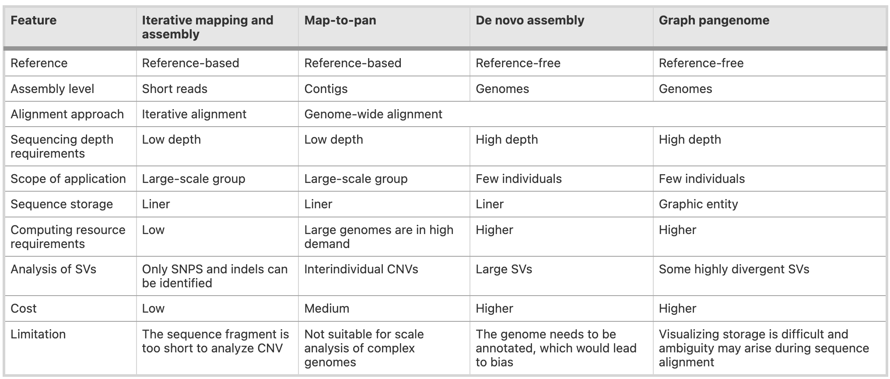
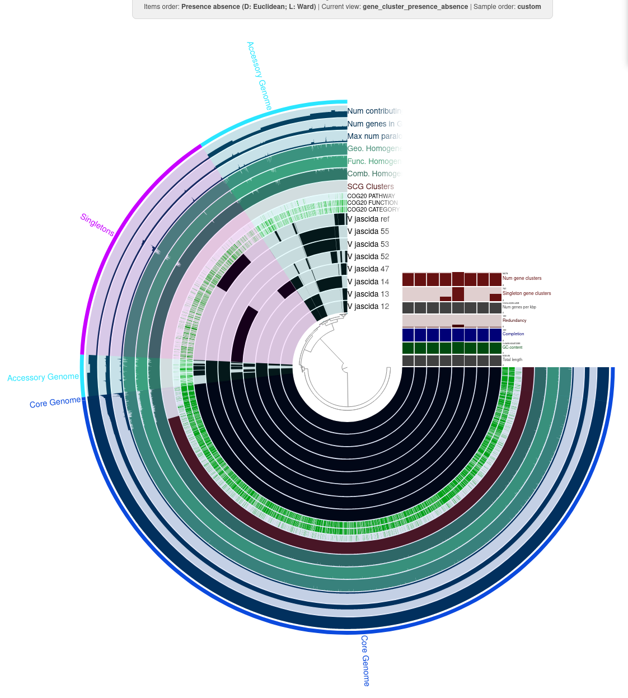

# Pangenomics

A pangenome is the `complete set of genomic information for a group of organisms`. It encompasses all the natural variation in the DNA of a species or a group of organisms.

There are two main contexts in which the term pangenome is used:
1. **Biological Pangenome:** Refers to the `natural variation in the DNA` of a species or group of organisms, representing the total genetic repertoire of that group.
2. **Computational Pangenome:** Refers to a pangenome that has been `catalogued and constructed` from genomic sequencing data using computational tools. It organizes and represents the genetic variation observed in the biological pangenome.

Pangenomics is the study of the pangenome. It involves:
- Analyzing the `variation within` and `between` the genomes of a group of organisms.
- Constructing `computational pangenomes` using sequencing data.
- Interpreting the biological significance of the genetic variation to understand evolution, function, and adaptation.

In essence, pangenomics focuses on `cataloguing, analyzing, and utilizing` the genomic diversity within a group of organisms.

## Types of Biological Pangenomes


## Types of Computational Pangenomes
### Presence–Absence Variation (PAV) Pangenome
PAV pangenomes quantify the `presence` and `absence` of genes within a population. They identify the `core genome`, which includes all of the genes present in all members of the population, `accessory/dispensable genome`, which includes all of the genes present in a subset of the population, and `Singletons` which are only present in one individual of the population.

Core gene functions are generally under high selective pressure and are highly conserved within the population. They tend to be older and essential for survival, while accessory genes tend to be less conserved and responsible for variations in lifestyle and evolutionary trajectories.

There are two main strategies for constructing a PAV pangenome:
1. **Homology-based Strategy:** This strategy involves annotating genomes individually, extracting gene sequences, and clustering them based on sequence similarity
2. **map-to-pan Strategy:** Whole-genome sequencing reads are aligned to an annotated representative sequence pangenome to determine gene presence or absence.


### Representative Sequence Pangenome
Representative sequence pangenomes are a collection of genomic sequences that minimize the inclusion of homologous loci while still representing as much genomic diversity from the population as possible.

They are usually composed of a reference genome and a number of other sequences called `nonredundant reference (NRR) sequences`. NRR sequences are sequences that are found in at least one member of the population but are not represented in the reference.

A representative sequence pangenome is constructed by identifying genomic sequences that aren’t already present in the reference genome. These sequences are appended to the reference genome as additional contigs to form a pangenome reference. The pangenome reference may then be optionally annotated.

Methods for Identifying NNR Sequences
1. **Metagenome-like Assembly of Unaligned:** Unaligned reads are treated as metagenomic data and assembled together as a single dataset.
2. **Independent Assembly of Unaligned Reads:** Unaligned reads from each sample are assembled independently and allows for the identification of unique sequences specific to each sample.
3. **Iterative Assembly of Unaligned Reads:** Reads from a single sample that don’t align with the reference are de novo assembled into contigs. These contigs (NRR sequences) are then appended to the reference genome, and this updated reference is used for processing the next sample.
4. **Independent Whole-Genome Assembly:** Reads from each sample are de novo assembled separately into contigs, which are then aligned to the reference genome. Unaligned contigs are pooled and clustered by sequence similarity. The longest sequence (an NRR sequence) is taken from each cluster and appended to the reference genome to form the pangenome.


### Pangenome Graph (Graphical Pangenome)
A sequence-oriented pangenome graph models the `location of genomic variation` within a species with respect to either a reference sequence or to the other sequences comprising the pangenome. They are composed of a set of `nodes` and `edges`. Nodes are segments of genomic sequence, and edges join these segments together.
1. **Sequence-Oriented Graph:** Models sequence variation at the nucleotide level, including its location relative to other sequences.
2. **Gene-Oriented Graph:** Models gene presence/absence and their relative order within the population.

There are three main methods for constructing sequence-oriented pangenome graphs
1. Predetermined variants: Requires a reference genome/sequence and a set of predetermined variants. Using a reference as the base of the graph, each variant is added to the graph as a `bubble`, resulting in a directed acyclic graph ordered along the reference genome.
2. Multiple sequence alignment: Constructed through the alignment of genomic sequences directly against each other.
3. De Bruijn graphs: reads are split into k-mers to form the nodes of the graph, and nodes are joined together based on their k-1 sequence length overlap with one another.



It’s impossible to capture the full extent of variation for larger organisms due to practical constraints in sequencing and analysis.

Pangenomes typically represent only a subset of variation to remain functional.

### Applications
- Estimating Evolutionary Trajectories
- Estimating gene functionality
- Study of functional specialisation and redundancy
- Community Dynamics and Population Genetics
- Genotyping and variant calling
- Haplotype inference
- Functional pangenomics
- Graph pangenome challenges

```bash
#!/bin/bash
#SBATCH --job-name=contig
#SBATCH --output=contig.out
#SBATCH --error=contig.err
#SBATCH --nodes=1
#SBATCH --ntasks-per-node=1
#SBATCH --cpus-per-task=12
#SBATCH --mem=25G
#SBATCH --partition=base
#SBATCH --time=5:00:00
#SBATCH --reservation=biol217

#load necessary modules
module load gcc12-env/12.1.0
module load micromamba/1.4.2
cd /work_beegfs/sunam227/pangenomics/
eval "$(micromamba shell hook --shell=bash)"
export MAMBA_ROOT_PREFIX=$WORK/.micromamba
micromamba activate .micromamba/envs/00_anvio/
```

Here, we first download the genomes of 52 *Vibrio jasicida* strains to compare them using Anvi´o. We will create a pangenome to analyse and visualise it.

Let´s start with downloading the genomes.

```bash
# Run on Front to Download the Data
curl -L https://ndownloader.figshare.com/files/28965090 -o V_jascida_genomes.tar.gz
tar -zxvf V_jascida_genomes.tar.gz
ls V_jascida_genomes
```

## Contig Database Creation and Processing

After downloading our genomes, I created a contig database `contig.dbs` from `.fasta` files. Each genome must be processed into an Anvi´o contigs database (contigs.db), which stores information about contigs, genes, and annotations. Here I used `anvi-script-reformat-fasta` to remove contigs smaller than 2500 nucleotides to eliminate low-quality results and simplify sequence names. Then I used `anvi-gen-contig-database` to convert each genome´s FASTA file into an Anvi´o database.

```bash
cd ./V_jascida_genomes/
ls *fasta | awk 'BEGIN{FS="_"}{print $1}' > genomes.txt


cd /work_beegfs/sunam227/pangenomics/V_jascida_genomes
# remove all contigs <2500 nt
for g in `cat genomes.txt`
do
    echo
    echo "Working on $g ..."
    echo
    anvi-script-reformat-fasta ${g}_scaffolds.fasta \
                               --min-len 2500 \
                               --simplify-names \
                               -o ${g}_scaffolds_2.5K.fasta
done

# generate contigs.db
for g in `cat genomes.txt`
do
    echo
    echo "Working on $g ..."
    echo
    anvi-gen-contigs-database -f ${g}_scaffolds_2.5K.fasta \
                              -o V_jascida_${g}.db \
                              --num-threads 4 \
                              -n V_jascida_${g}
done

# annotate contigs.db
for g in *.db
do
    anvi-run-hmms -c $g --num-threads 4
    anvi-run-ncbi-cogs -c $g --num-threads 4
    anvi-scan-trnas -c $g --num-threads 4
    anvi-run-scg-taxonomy -c $g --num-threads 4
done
```

After that we will visualise our `contigs.db`. In order to do that we need to access `Anvi´o Interactive` by running fallowing commands on the terminal.

```bash
module load gcc12-env/12.1.0
module load micromamba/1.4.2
cd $WORK
micromamba activate .micromamba/envs/00_anvio/

anvi-display-contigs-stats /work_beegfs/sunam227/pangenomics/V_jascida_genomes/*db

srun --reservation=biol217 --pty --mem=16G --nodes=1 --tasks-per-node=1 --cpus-per-task=1 --partition=base /bin/bash

module load gcc12-env/12.1.0
module load micromamba/1.4.2
cd $WORK
micromamba activate .micromamba/envs/00_anvio/
anvi-display-contigs-stats /work_beegfs/sunam227/pangenomics/V_jascida_genomes/*db
```

Then by opening a new terminal, fallowing commands needed to run.

```bash
ssh -L 8060:localhost:8080 sunam###@caucluster.rz.uni-kiel.de
ssh -L 8080:localhost:8080 n100 # n100 and localhost should be changed according to assigned node and host
```

If you want to exit from the node use `Ctrl + D` twice.

We´ll continue with creating external genomes file. I used `anvi-script-gen-genomes-file` to create my external genome file, which will serve as an input for pangenome analysis.

```bash
anvi-script-gen-genomes-file --input-dir /work_beegfs/sunam227/pangenomics/V_jascida_genomes \
                             -o external-genomes.txt
```

Then I compute my pangenome with fallowing commands

```bash
cd /work_beegfs/sunam227/pangenomics/V_jascida_genomes
anvi-gen-genomes-storage -e external-genomes.txt \
                         -o V_jascida-GENOMES.db

anvi-pan-genome -g V_jascida-GENOMES.db \
                --project-name V_jascida \
                --num-threads 4          
```

To display our pangeome we will run fallowing command on the terminal

```bash
srun --pty --mem=10G --nodes=1 --tasks-per-node=1 --cpus-per-task=1 --partition=base /bin/bash

module load gcc12-env/12.1.0
module load micromamba/1.4.2
micromamba activate .micromamba/envs/00_anvio/

anvi-display-pan -p /work_beegfs/sunam227/pangenomics/V_jascida_genomes/V_jascida/V_jascida-PAN.db \
                 -g /work_beegfs/sunam227/pangenomics/V_jascida_genomes/V_jascida-GENOMES.db


# In another terminal
ssh -L 8060:localhost:8080 sunam227@caucluster.rz.uni-kiel.de
ssh -L 8080:localhost:8080 n100 # n100 and localhost should be changed according to assigned node and host
```




Now let's perform another pangenome analysis by using another species. In the fallowing part we will run the script as it is instead of one by one. Now let's check our data.

Instead of using single-species, I decided to perform a same genus multi-species pangenome analysis to understand their genomic diversity, evolutionary relationships, and functional differences. By analyzing the pangenome of 6 different species, we can classify genes into three main categories:
- Core genome: Genes shared by all species, essential for basic survival and defining the genus.
- Accessory genome: Genes present in some species but absent in others, related to adaptation, niche specialization, and strain-level differences.

since we do not have multiple sequences from each species we can't able to detect singletons and intra-specific variation.

By studying multiple species we can also study how their genomes have evolved from a common ancestor. Identifying gene gain, loss, and horizontal gene transfer (HGT) events can reveal how different species diverged and adapted to different environments.

We are going to analyse three different *Anabanea* species, you can download the sequences from here:
1. *Anabaena cylindrica* [PCC 7122](https://www.ncbi.nlm.nih.gov/datasets/genome/GCF_000317695.1/)
2. *Anabaena sphaerica* [FACHB-251](https://www.ncbi.nlm.nih.gov/datasets/genome/GCF_014696825.1/)
3. *Anabaena lutea* [FACHB-196](https://www.ncbi.nlm.nih.gov/datasets/genome/GCF_014698305.1/)
4. *Anabaena azotica* [FACHB-119](https://www.ncbi.nlm.nih.gov/datasets/genome/GCF_014697625.1/)
5. *Anabaena catenula* [FACHB-362](https://www.ncbi.nlm.nih.gov/datasets/genome/GCF_014698735.1/)
6. *Anabaena subtropica* [FACHB-260](https://www.ncbi.nlm.nih.gov/datasets/genome/GCF_014697105.1/)

In case you are going to perform more detailed work, you can add more individuals for each species and can include intra-species variations in your analysis.

## *Anabaena* Genus
The genus *Anabaena* consists of filamentous, heterocyst-forming cyanobacteria commonly found in freshwater, soil, and symbiotic relationships with plants. Ecological properties and diverse habitat occupation of these species make *Anabaena* an essential genus for studying environmental microbiology, evolutionary genomics, and biotechnological applications.

### By analyzing these six species, we can
- Identify core genes shared across Anabaena, revealing genus-level essential functions.
- Discover accessory genes unique to specific species, explaining ecological and physiological differences.
- Study genomic adaptations to different environments.
- Investigate nitrogen fixation efficiency, photosynthetic pathways, and metabolic diversity of each species.
- Understand horizontal gene transfer (HGT) and how species evolve within the genus.


```bash
#!/bin/bash
#SBATCH --job-name=pangenome
#SBATCH --output=pangenome.out
#SBATCH --error=pangenome.err
#SBATCH --nodes=1
#SBATCH --ntasks-per-node=1
#SBATCH --cpus-per-task=12
#SBATCH --mem=25G
#SBATCH --partition=base
#SBATCH --time=5:00:00
#SBATCH --reservation=biol217

#load necessary modules
module load gcc12-env/12.1.0
module load micromamba/1.4.2
cd /work_beegfs/sunam227/test_pangenome/
eval "$(micromamba shell hook --shell=bash)"
export MAMBA_ROOT_PREFIX=$WORK/.micromamba
micromamba activate 00_anvio

cd /work_beegfs/sunam227/test_pangenome/sequences

for file in *.fna; do mv "$file" "${file%.fna}.fasta"; done
ls *fasta | awk 'BEGIN{FS="."}{print $1}' > genomes.txt

# 1 remove all contigs <2500 nt
for g in `cat genomes.txt`
do
    echo
    echo "Working on $g ..."
    echo
    anvi-script-reformat-fasta ${g}.fasta \
                               --min-len 2500 \
                               --simplify-names \
                               -o ${g}_2.5K.fasta
done

# 2 generate contigs.db
for g in `cat genomes.txt`
do
    echo
    echo "Working on $g ..."
    echo
    anvi-gen-contigs-database -f ${g}_2.5K.fasta \
                              -o Anabaena_${g}.db \
                              --num-threads 4 \
                              -n Anabaena_${g}
done

# 3 annotate contigs.db
for g in *.db
do
    anvi-run-hmms -c $g --num-threads 4
    anvi-run-ncbi-cogs -c $g --num-threads 4
    anvi-scan-trnas -c $g --num-threads 4
    anvi-run-scg-taxonomy -c $g --num-threads 4
done

# 4 creating an external genome file
anvi-script-gen-genomes-file --input-dir /work_beegfs/sunam227/test_pangenome/sequences \
                             -o external-genomes.txt

# 5 Estimating contamination
anvi-estimate-genome-completeness -e external-genomes.txt

# 6 computing a pangenome
cd /work_beegfs/sunam227/test-pangenome/sequences
anvi-gen-genomes-storage -e external-genomes.txt \
                         -o Anabanea-GENOMES.db

anvi-pan-genome -g Anabanea-GENOMES.db \
                --project-name Anabea \
                --num-threads 4                         

###############################################################

# We can display our pangenome here if we want
anvi-display-pan -p Anabea/Anabea-PAN.db \
                    -g Anabaneas-GENOMES.db

# Here in the naming there is a mistake I did, but just make
# sure you are writing the same file names at this point

###############################################################

# 7 calculating average nucleotide identity ANI
anvi-compute-genome-similarity --external-genomes external-genomes.txt \
                               --program pyANI \
                               --output-dir ANI \
                               --num-threads 12 \
                               --pan-db Anabea/Anabea-PAN.db 


# 8 phylogenomic tree
anvi-get-sequences-for-gene-clusters -p Anabea/Anabea-PAN.db \
                                     -g Anabanea-GENOMES.db \
                                     --min-num-genomes-gene-cluster-occurs 6 \
                                     --max-num-genes-from-each-genome 1 \
                                     --concatenate-gene-clusters \
                                     --output-file Anabea/Anabanea-SCGs.fa


trimal -in Anabea/Anabanea-SCGs.fa \
       -out Anabea/Anabanea-SCGs-clean.fa \
       -gt 0.5

# 9 Displaying final pangenome
# Run fallowing command on the terminal
srun --pty --mem=10G --nodes=1 --tasks-per-node=1 --cpus-per-task=1 --partition=base /bin/bash

module load gcc12-env/12.1.0
module load micromamba/1.4.2
micromamba activate 00_anvio

anvi-display-pan -p /work_beegfs/sunam227/pangenomics/V_jascida_genomes/V_jascida/V_jascida-PAN.db \
                 -g /work_beegfs/sunam227/pangenomics/V_jascida_genomes/V_jascida-GENOMES.db


# Open Another terminal and run the fallowing code
ssh -L 80??:localhost:80?? sunam???@caucluster.rz.uni-kiel.de
ssh -L 80??:localhost:80?? n???

# change the "?" according to assigned node and host and run the fallowing
anvi-display-pan -p ./sequences/Anabea/Anabea-PAN.db \
                    -g ./sequences/Anabanea-GENOMES.db

#micromamba activate .micromamba/envs/00_anvio/

# ##----------------- End -------------
module purge
jobinfo
```


http://0.0.0.0:8082