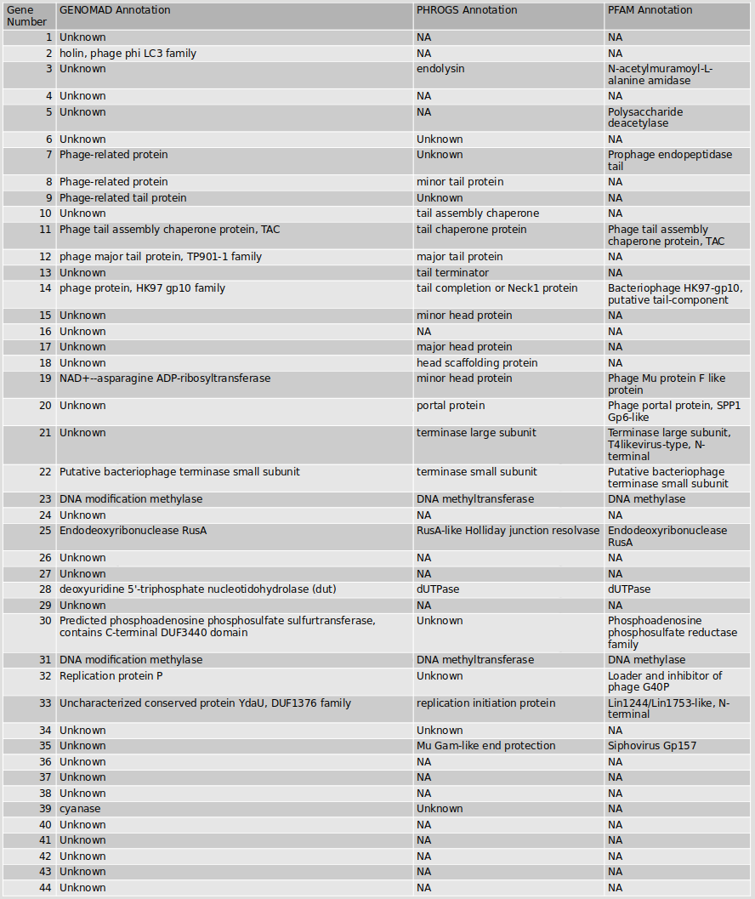

# Metaviromics

Viral Infections can transform ecosystems
- Viruses influence microbial community structure and diversity
- Viruses act as leteral gene transfer agents
- Viruses alter host cell phenotype


 ```bash
#!/bin/bash
#SBATCH --job-name=TASK
#SBATCH --output=TASK.out
#SBATCH --error=TASK.err
#SBATCH --nodes=1
#SBATCH --ntasks-per-node=1
#SBATCH --cpus-per-task=12
#SBATCH --mem=25G
#SBATCH --partition=base
#SBATCH --time=5:00:00
#SBATCH --reservation=biol217

#load necessary modules
module load gcc12-env/12.1.0
module load micromamba
eval "$(micromamba shell hook --shell=bash)"
export MAMBA_ROOT_PREFIX=$WORK/.micromamba
#micromamba activate .micromamba/envs/00_anvio/
```

Firstly activate the required modules for the processing of viromics data.

```bash
module load gcc12-env/12.1.0
module load micromamba/1.3.1
micromamba activate MVP
cd /work_beegfs/sunam227/viromics
```

## Identification and Viral Taxonomy


```bash
mvip MVP_00_set_up_MVP -i ./WORKING_DIRECTORY/ -m input_file_timeseries_final.csv  --genomad_db_path ./WORKING_DIRECTORY/00_DATABASES/genomad_db/ --checkv_db_path ./WORKING_DIRECTORY/00_DATABASES/checkv-db-v1.5/
mvip MVP_00_set_up_MVP -i ./WORKING_DIRECTORY/ -m input_file_timeseries_final.csv  --skip_install_databases
```


## Quality Assesment and Filtering


```bash
mvip MVP_01_run_genomad_checkv -i WORKING_DIRECTORY/ -m input_file_timeseries_final.csv
mvip MVP_02_filter_genomad_checkv -i WORKING_DIRECTORY/ -m input_file_timeseries_final.csv
```


## ANI Clustering


```bash
mvip MVP_03_do_clustering -i WORKING_DIRECTORY/ -m input_file_timeseries_final.csv
```


## Abundance Estimation


```bash
mvip MVP_04_do_read_mapping -i WORKING_DIRECTORY/ -m input_file_timeseries_final.csv --delete_files
mvip MVP_05_create_vOTU_table -i WORKING_DIRECTORY/ -m input_file_timeseries_final.csv
```


## Gene Functional Annotation


```bash
mvip MVP_06_do_functional_annotation -i WORKING_DIRECTORY/ -m input_file_timeseries_final.csv
```


## Viral Binning


```bash
mvip MVP_07_do_binning -i WORKING_DIRECTORY/ -m input_file_timeseries_final.csv --force_outputs
```


## Summarysing Results


```bash
mvip MVP_100_summarize_outputs -i WORKING_DIRECTORY/ -m input_file_timeseries_final.csv
```


## Viral Host Prediction


```bash
module load miniconda3/4.12.0
conda activate GTDBTk
export GTDBTK_DATA_PATH=./GTDB_db/GTDB_db

gtdbtk de_novo_wf --genome_dir fa_all/ \
--bacteria --outgroup_taxon p__Patescibacteria \
--out_dir output/ \
--cpus 12 --force --extension fa

gtdbtk de_novo_wf --genome_dir fa_all/ \
--archaea --outgroup_taxon p__Altarchaeota \
--out_dir output/ \
--cpus 12 --force --extension fa

module load micromamba/1.3.1
micromamba activate iphop_env
iphop add_to_db --fna_dir fa_all/ \
--gtdb_dir ./output/ \
--out_dir ./MAGs_iPHoP_db \
--db_dir iPHoP_db/

iphop predict --fa_file ./MVP_07_Filtered_conservative_Prokaryote_Host_Only_best_vBins_Representative_Unbinned_vOTUs_Sequences_iPHoP_Input.fasta \
--db_dir ./MAGs_iPHoP_db \
--out_dir ./iphop_output -t 12

# ##----------------- End -------------
module purge
jobinfo
```


### Questions

1. How many viruses are in the BGR_140717 sample?
- 11 for proviruses, 847 viruses
2. How many Caudoviricetes viruses in the BGR_141022, and how many High-Quality and complete viruses in this sample?

```bash
grep -c "Caudoviricetes" 02_CHECK_V/BGR_141022/MVP_02_BGR_141022_Filtered_Relaxed_Merged_Genomad_CheckV_Virus_Proviruses_Quality_Summary.tsv
grep -c "High-quality" 02_CHECK_V/BGR_141022/MVP_02_BGR_141022_Filtered_Relaxed_Merged_Genomad_CheckV_Virus_Proviruses_Quality_Summary.tsv
```
401 Caudoviricetes is found on sample BGR_141022

there are 0 high quality and complete viruses

3. How many Low-Quality/Medium-quality/High-quality/Complete virues in BGR_140717

grep -c "Low-quality" 02_CHECK_V/BGR_140717/MVP_02_BGR_140717_Filtered_Relaxed_Merged_Genomad_CheckV_Virus_Proviruses_Quality_Summary.tsv
grep -c "Medium-quality" 02_CHECK_V/BGR_140717/MVP_02_BGR_140717_Filtered_Relaxed_Merged_Genomad_CheckV_Virus_Proviruses_Quality_Summary.tsv
grep -c "High-quality" 02_CHECK_V/BGR_140717/MVP_02_BGR_140717_Filtered_Relaxed_Merged_Genomad_CheckV_Virus_Proviruses_Quality_Summary.tsv

- 564 low
- 3 medium
- 1 high
- 1 complete

4. What is the length of the complete virus? How many viral hallmark genes?
- 31258 bp of lenght and 10 viral hallmark genes
5. Check how abundant is your complete virus in the different samples (RPKM)?
- 305.86407
6. What are typical annotations you see? What could the functions be?

7. Now look for the category of “moron, auxiliary metabolic gene and host takeover” any toxin genes???? Quickly look up the function of this toxin.
- Zot-like toxin, and it is found to linked to the regulation of host virulance genes, enterotoxic activity and take role in CTXφ morphonogenesis.
8. How many High-quality viruses after binning in comparison to before binning?
- 9 High-quality viruses after binning, it was 1 previously.
9. Are any of the identified viral contigs complete circular genomes? (based on identifying direct terminal repeat regions on both ends of the genome)
- there is just one, BGR_140717_NODE_168_length_31258_cov_37.020094
10. What are the predicted hosts for your complete virus? are there multiple predicted hosts? are the hosts distantly related?
- We predicted our host species from fallowing taxa:
  - Bacteria
  - Bacillota
  - Clostridia
  - Tissierellales
  - Peptoniphilaceae
  - Genus: Unpredicted
  - Species: Unpredicted

- Some viruses are assigned to more than one host, in our cases not our complete virus. For example, BGR_130527_NODE_365_length_14183_cov_15.647721 is assigned to 3 different and distantly related hosts. It is assigned to *Anaerosphaera multitoleran*, *Levyella massiliensis*, and family Cloacimonadaceae.


11. Discuss what might be the reasons based on 1) biological reasoning, 2) the prediction method or 3) potential contamination in host MAG that migh result in such a prediction.
