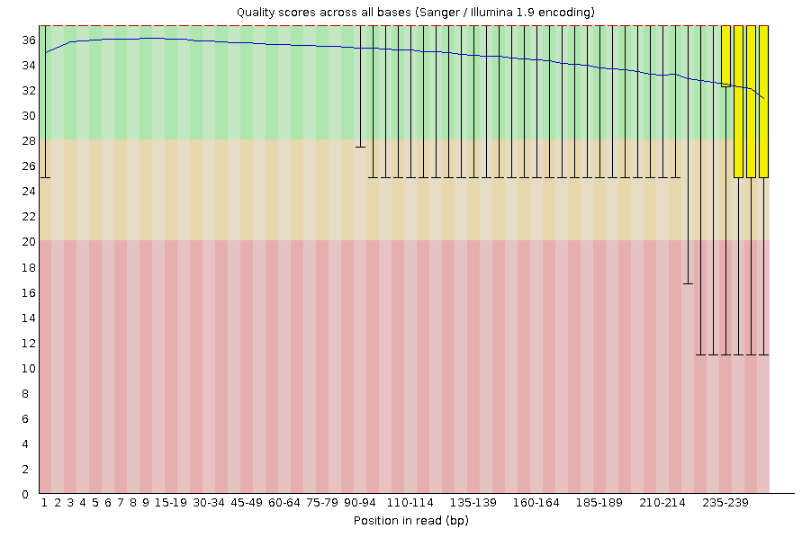
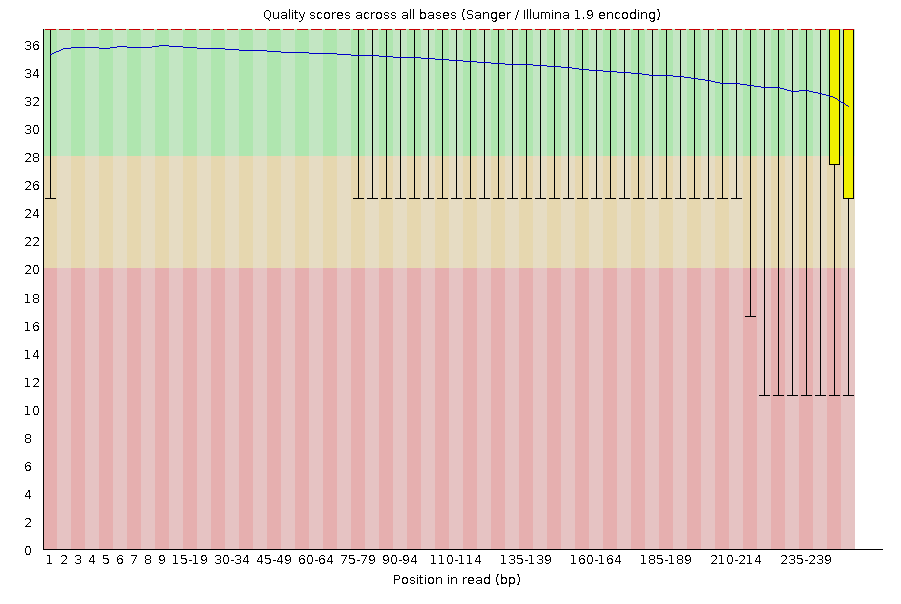

# GENOMIS
Genome is complete set of genetic information in an organism. (Add what is Genomics)

Key Terms:
- DNA
- Genes
- Non-coding DNA
- Chromosomes
- Genetic Information
- Variation
- Sequencing and Analysis

Pan-Genomics is the field of genomis that studies the full complement od genes and non coding sequences in a group of related organisms.

Transcriptomics is the study of the transcriptome, the complete set of RNA transcripts by the genome under specific circumstances or in a specific cell.
- Expressed Genes
- Gene Function
- Gene Regulation
- Molecular Mechanisms

Translatomics is the study of the complete sets of RNA molecules being translated into protein in a cell at any given time. This area examines translation process rather than transcriptomics.

### Steps of Assembeling a Genome:
1. DNA sample preperation
2. Sequencing
3. Quality Control
4. Read Alingment/Mapping
5. De Novo Assembly
6. Scaffolding
7. Gap Filling
8. Error Correction
9. Validation and Refinement
10. Annotation
11. Taxonomic Classification
12. Analysis

! we need to write if we can have paired and of long reads !

```bash
#!/bin/bash
#SBATCH --job-name=TASK
#SBATCH --output=TASK.out
#SBATCH --error=TASK.err
#SBATCH --nodes=1
#SBATCH --ntasks-per-node=1
#SBATCH --cpus-per-task=1
#SBATCH --mem=8GB
#SBATCH --partition=base
#SBATCH --time=00:20:00
#SBATCH --reservation=biol217

#load necessary modules
module load gcc12-env/12.1.0
module load micromamba
eval "$(micromamba shell hook --shell=bash)"
export MAMBA_ROOT_PREFIX=$WORK/.micromamba

cd $WORK
```

## Quality Control

Here we used `fastqc` to evaluate the quality of the raw paired-end short reads. This step is crucial to identify potential issues with our sequences. Such issues might be low base calling, contamination by adapter sequences and over-represented k-mers, GC content biases, etc. By using `fastqc`, we will know what we need to trim, and remove from our reads.

```bash
# Quality Control of R1 and R2 Raw Reads
cd /work_beegfs/sunam227/genomics
mkdir -p ./short_reads_processed/short_reads_qc
for file in ./0_raw_reads/short_reads/*.gz; do
    fastqc $file -o ./short_reads_processed/short_reads_qc -t 32;
done
```
Here you can see the quality check results of the short reads.

### Quality of Raw Read R1

### Quality of Raw Read R2


Then I used `fastp` to clean short reads. `fast` filters out low quality reads based on phred score, removes poor-quality bases from ends of reads, and remove adapter sequences which were detected during initial `fastqc` report. In our sequences, we did not find any kind of adapter contamination.

```bash
# Quality Trimming and Cleaning of R1 and R2 Raw Reads
cd /work_beegfs/sunam227/genomics
mkdir -p ./short_reads_processed/clean_reads
fastp -i ./0_raw_reads/short_reads/241155E_R1.fastq.gz \
 -I ./0_raw_reads/short_reads/241155E_R2.fastq.gz \
 -R ./short_reads_processed/clean_reads/fastp_report \
 -h ./short_reads_processed/clean_reads/report.html \
 -o ./short_reads_processed/clean_reads/241155E_R1_clean.fastq.gz \
 -O ./short_reads_processed/clean_reads/241155E_R2_clean.fastq.gz -t 6 -q 25

# Quality Control of R1 and R2 Cleaned Reads
cd /work_beegfs/sunam227/genomics
for file in ./short_reads_processed/clean_reads/*.gz; do
    fastqc $file -o ./short_reads_processed/short_reads_qc -t 32;
done
```
Here you can see the `fastqc` result after our cleaning and trimming process

### Quality of Cleaned Read R1

### Quality of Cleaned Read R2


Read1 before filtering:
total reads: 1639549
total bases: 411526799
Q20 bases: 388578215(94.4236%)
Q30 bases: 354526745(86.1491%)

Read1 after filtering:
total reads: 1613392
total bases: 395124999
Q20 bases: 374956131(94.8956%)
Q30 bases: 343313213(86.8872%)


Read2 before filtering:
total reads: 1639549
total bases: 411526799
Q20 bases: 385928972(93.7798%)
Q30 bases: 353698765(85.9479%)

Read2 after filtering:
total reads: 1613392
total bases: 395124999
Q20 bases: 373763591(94.5938%)
Q30 bases: 343873143(87.029%)


Filtering result:
reads passed filter: 3226784
reads failed due to low quality: 52310
reads failed due to too many N: 4
reads failed due to too short: 0
reads with adapter trimmed: 4206
bases trimmed due to adapters: 319560

Duplication rate: 4.12309%

In addition to our short reads, we also had long reads. Long reads are required to fill gaps that might occur during short read assembly.

```bash
micromamba activate 02_long_reads_qc

# Quality Control of Raw Long Reads NanoPlot
cd $WORK/genomics/0_raw_reads/long_reads/
mkdir -p $WORK/genomics/long_reads_processed/long_reads_qc/nanoplot_raw
NanoPlot --fastq $WORK/genomics/0_raw_reads/long_reads/*.gz \
 -o $WORK/genomics/long_reads_processed/long_reads_qc/nanoplot_raw -t 16 \
 --maxlength 40000 --minlength 1000 --plots kde --format png \
 --N50 --dpi 300 --store --raw --tsv_stats --info_in_report

# Trimming and Cleaning of Long Reads by Filtlong
cd $WORK/genomics
mkdir ./long_reads_processed/clean_reads
filtlong --min_length 1000 --keep_percent 90 ./0_raw_reads/long_reads/*.gz | gzip > ./long_reads_processed/clean_reads/241155E_cleaned_filtlong.fastq.gz

# Quality Control of Cleaned Long Reads by NanoPlot
cd $WORK/genomics/long_reads_processed
mkdir -p $WORK/genomics/long_reads_processed/long_reads_qc/nanoplot_cleaned
NanoPlot --fastq ./clean_reads/*.gz \
 -o ./long_reads_qc/nanoplot_cleaned -t 16 \
 --maxlength 40000 --minlength 1000 --plots kde --format png \
 --N50 --dpi 300 --store --raw --tsv_stats --info_in_report
```

### Genome Assembly

```bash
eval "$(micromamba shell hook --shell=bash)"
micromamba activate 03_unicycler
cd $WORK/genomics
mkdir -p $WORK/genomics/hybrid_assembly
unicycler -1 ./short_reads_processed/clean_reads/241155E_R1_clean.fastq.gz -2 ./short_reads_processed/clean_reads/241155E_R2_clean.fastq.gz -l ./long_reads_processed/clean_reads/241155E_cleaned_filtlong.fastq.gz -o ./hybrid_assembly/ -t 32
micromamba deactivate
```

### Assembly Quality

```bash
cd $WORK

# Quast
micromamba activate .micromamba/envs/04_quast
cd $WORK/genomics
mkdir ./hybrid_assembly/assembly_quality/quast
quast.py ./hybrid_assembly/assembly.fasta
+ --circos
+ -L --conserved-genes-finding --rna-finding \
+ --glimmer
+ --use-all-alignments
+ --report-all-metrics
+ -o ./hybrid_assembly/assembly_quality/quast
+ -t 32

# CheckM
micromamba activate .micromamba/envs/04_checkm
# Create the output directory if it does not exist
cd $WORK/genomics/hybrid_assembly
mkdir -p ./assembly_quality/checkm
checkm lineage_wf $WORK/genomics/hybrid_assembly/ ./assembly_quality/checkm -x fasta --tab_table --file ./assembly_quality/checkm/checkm_results -r -t 32
checkm tree_qa ./assembly_quality/checkm
checkm qa ./assembly_quality/checkm/lineage.ms ./assembly_quality/checkm/ -o 1 > ./assembly_quality/checkm/Final_table_01.csv
checkm qa ./assembly_quality/checkm/lineage.ms ./assembly_quality/checkm/ -o 2 > ./assembly_quality/checkm/final_table_checkm.csv
micromamba deactivate


# Checkm2
cd $WORK
micromamba activate .micromamba/envs/04_checkm2
cd $WORK/genomics/hybrid_assembly
mkdir -p ./assembly_quality/checkm2
checkm2 predict --threads 32 --input ./assembly.fasta --output-directory ./assembly_quality/checkm2 
micromamba deactivate
```

### Gene Annotation
```bash
cd $WORK
micromamba activate .micromamba/envs/05_prokka
cd $WORK/genomics/hybrid_assembly
prokka ./assembly.fasta --outdir $WORK/genomics/annotated_genome --kingdom Bacteria --addgenes --cpus 32
micromamba deactivate
```

### Classification of the Genomes

```bash
# Activate required environments
cd $WORK
micromamba activate .micromamba/envs/06_gtdbtk
conda env config vars set GTDBTK_DATA_PATH="$WORK/databases/gtdbtk/release220";
micromamba activate .micromamba/envs/06_gtdbtk

cd $WORK/genomics/annotated_genome
mkdir -p $WORK/genomics/gtdb_classification
gtdbtk classify_wf --cpus 4 --genome_dir $WORK/genomics/annotated_genome --out_dir $WORK/genomics/gtdb_classification --extension .fna --skip_ani_screen
micromamba deactivate
```

### Combining Reports

```bash
cd $WORK
micromamba activate .micromamba/envs/01_short_reads_qc
multiqc -d $WORK/genomics/ -o $WORK/genomics/multiqc


# ##----------------- End -------------
module purge
jobinfo
```