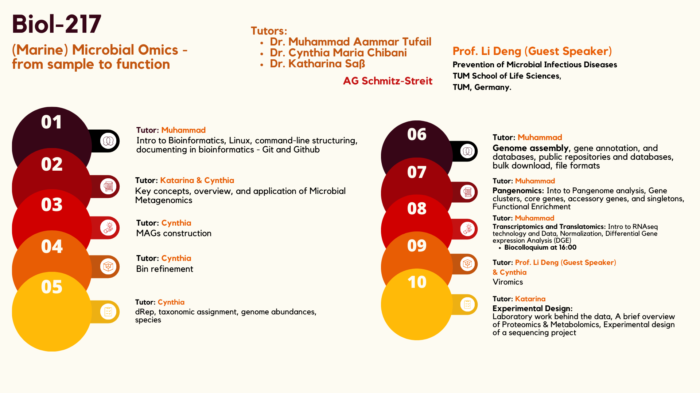

# Day-1 Protocol
## Second Heading
### Third Heading
- bullet 1
- bullet 2

1. point bullet 1
2. point bullet 2

**Bold Text**
*Italic Text*

> Highlight this

```bash
fastqc *.fastq
```

I used `fastq.gz` files for starting point.


[Link to GitHub repository](https://github.com/AammarTufail/biol217_2025)



